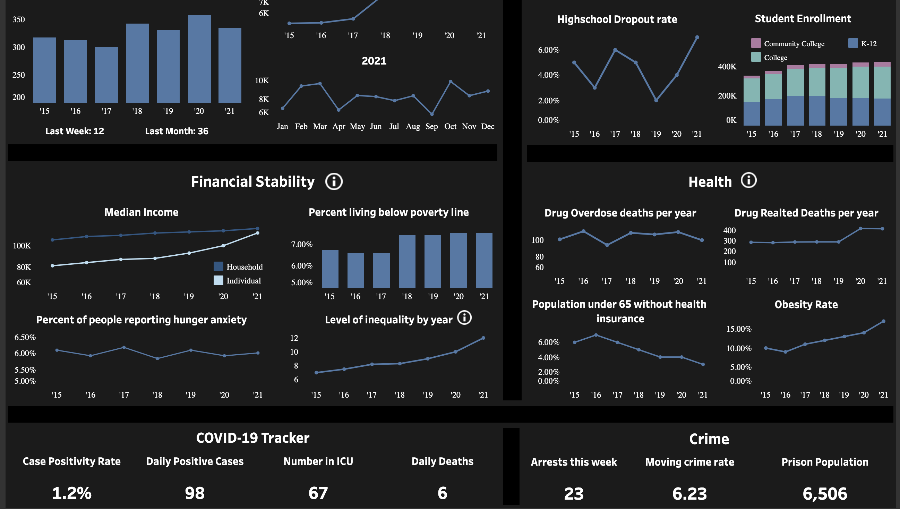
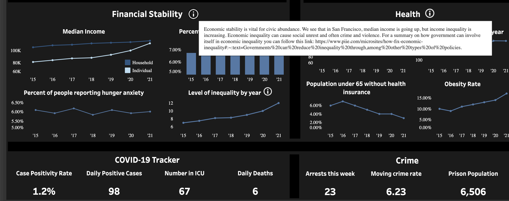

## SF City Dashboard:
This is a mock dashboard of different city metrics which may be interesting to the residents of San Francisco. The idea behind this is to create a good visualization that residents could check in on to see how their city is doing in certain issue areas. This can then lead to discussions on solutions to achieve goals on certain quantifiable metrics (i.e. lower the homeless population to 4,000, lower the rate of increase in median 1 br apartments, increase graduation rate, etc.).

I used Tableau for the dashboard and embedded it into a full web app using Python (Flask) and some light Javascript.

## Link:
https://main-crow-345802.wm.r.appspot.com/dashboard

## Screenshots

